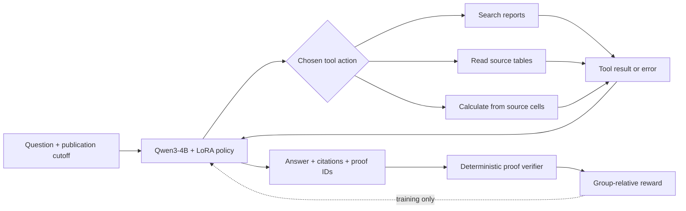

# Agentic RL for Financial Question Answering

**Train the tool-use policy, verify the evidence, and measure transfer to new companies.**

A Qwen3-4B financial QA agent trained with LoRA supervised fine-tuning and
three rounds of iterative GRPO. It decides when to search reports, read source
tables, calculate from evidence cells, recover from tool errors, and answer.
The retrieval environment supports the task; reinforcement learning updates
the policy that chooses the actions.

**Held-out result: 45.3% → 66.4% source-verified task success (+21.1 percentage
points), with 55.1% fewer invalid actions and 11.5% fewer inference tokens.**

Python · PyTorch · Transformers · PEFT/LoRA · GRPO · vLLM · Slurm

## Results

64 precommitted questions from four companies outside the project's training
and development sets. All three policies use the same environment, decoding
settings and budgets. The primary score averages two predeclared repeats per
question; there are **64 unique questions**, not 384 independent questions.

| Policy | Repeat 1 | Repeat 2 | Average success | Invalid actions | Total tokens |
|---|---:|---:|---:|---:|---:|
| LoRA SFT | 30/64 | 28/64 | 45.31% | 341 | 8,821,482 |
| Original GRPO | 35/64 | 34/64 | 53.91% | 266 | 8,791,191 |
| **Iterative GRPO** | **43/64** | **42/64** | **66.41%** | **153** | **7,804,391** |

Action and token totals cover 128 attempts per policy, including failures.
Success requires the correct answer **and** the required source-backed proof.
All 384 episodes and 2,859 responses passed the original local protocol audit;
source review left scores unchanged. [Results and limitations →](docs/results.md)

## How it works



- **SFT:** 44 demonstrations from 26 training questions, exported as 204
  action targets; only model action tokens receive the supervised loss.
- **Iterative GRPO:** three fresh batches of 104 episodes, two full-batch
  optimizer updates per round, and a fixed SFT reference policy. All rounds
  use the same questions and verifiable reward.
- **Training safeguards:** action-token masks, PPO clipping, sampled KL
  penalty, separate behavior-probability correction, finite-gradient checks,
  frozen-base checks and adapter save/reload verification.
- **Evaluation:** development-only checkpoint selection, then a frozen
  three-policy test on four new companies, with private labels excluded from
  the collection package. Labels are now published for replay.

## Run a real trajectory locally

The demo replays a recorded policy trajectory through the actual tools. It
does **not** generate a new model answer. Python 3.10+ is sufficient; no GPU,
model download, API key or additional package is needed for these commands.

```bash
git clone https://github.com/Jiongran-Wang/agentic-rl-financial-qa.git
cd agentic-rl-financial-qa
python3 scripts/unpack_inputs.py
python3 scripts/demo.py
```

The example searches two annual reports, reads the source cells, subtracts
total assets and returns **12,304,705,336.12 yuan** with citations and a verified
calculation. [See the recorded example →](docs/demo.md)

Replay every evaluation episode and recompute the published success rates:

```bash
python3 scripts/audit_public_results.py
```

Allow several minutes for 384 episodes. The public replay checks actions,
tool observations through full-episode hashes, and proof grades. It does not
rerun model inference or independently recheck the omitted server logs.

## Tests and training code

```bash
python3 -m venv .venv
source .venv/bin/activate
python -m pip install -r requirements-test.txt
OMP_NUM_THREADS=1 python -m unittest discover -s tests -v
```

The tests include tiny-model LoRA updates, clipping/correction behavior,
reference restoration, action-token masking, checkpoint reload, tool budgets,
and paired evaluation aggregation. They run on CPU without downloading model
weights. CI runs the lightweight protocol tests.

| Entry point | Purpose |
|---|---|
| [Environment](training/retail/environment.py) | Model-selected search/read/calculate/final actions |
| [Proof reward](training/retail/rewards_v2.py) | Numeric equivalence, units, source cells and operations |
| [SFT trainer](scripts/train_retail_sft_pilot_v1.py) | Action-masked LoRA supervised training |
| [GRPO objective](training/retail/grpo_update_v2.py) | Clipped objective and detached behavior correction |
| [One fresh RL round](scripts/train_retail_grpo_iter_round_v1.py) | Collect, score, optimize and verify a checkpoint |
| [Three-round driver](scripts/run_retail_grpo_iter_v1.py) | Fresh rounds and development-only selection |
| [Evaluation collector](scripts/eval_retail_grpo_heldout_v2.py) | Matched three-policy vLLM evaluation |

These are the hash-preserved experiment implementations, including versioned
filenames. GPU training requires the pinned runtime and checkpoint inputs;
the original adapters are **not** distributed here. See
[reproduction scope and training requirements](docs/reproduction.md).

## What this result establishes

This is a bounded agentic RL experiment, not a production financial adviser or
a broad reasoning benchmark. It uses four reports, templated questions,
same-author source review and one training seed; pretraining exposure is
unknown. Compare-then-lookup success remains 12.5%. Strict proof matching can
reject a numerically correct answer with extra calculations. Additional
training compute and refreshed trajectories changed together, so the result
does not isolate the effect of refresh at equal compute. The test is now
inspected and must not guide further tuning.

[Detailed results](docs/results.md) · [Method](docs/method.md) ·
[Reproduction](docs/reproduction.md) · [Data sources](docs/data.md)
